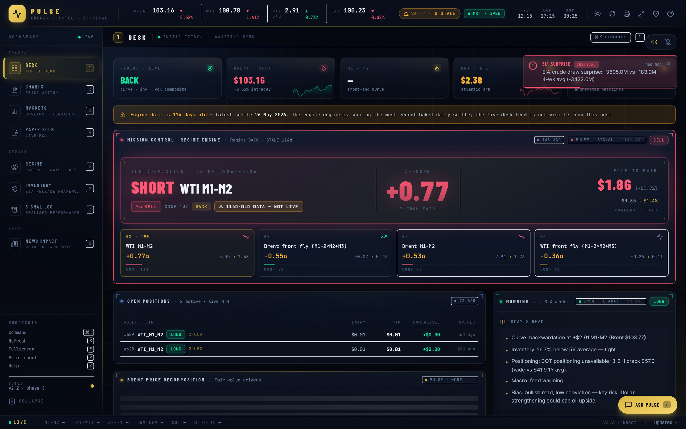
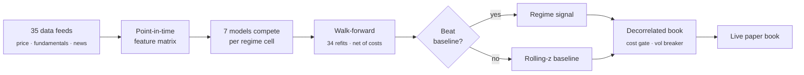

<div align="center">

# PULSE

### Energy Intelligence Terminal

**A systematic trading research stack for crude calendar spreads.**
Hypothesis, alternative data, walk-forward validation, live deployment.

**[Live demo](https://rohithpranav45-pulse.hf.space)** &nbsp;·&nbsp; **[Methodology](docs/report/PULSE_One_Page_Report.pdf)** &nbsp;·&nbsp; **[Project state](docs/PROJECT_STATE.md)**



</div>

---

```bash
pip install -r requirements.txt
python start.py          # http://127.0.0.1:5000
```

---

## The finding

> **I built a regime-conditional model. A rolling z-score with no regime awareness beat it.**
> That result is the headline of this repository, because it is the result the data gave.

**Hypothesis.** Crude calendar spreads mean-revert differently across market regimes (curve
shape, inventory level, realised volatility), so a regime-conditioned model should beat one
that ignores the regime.

**Test.** Expanding-window walk-forward, 2018 to 2026, 34 quarterly refits. Point-in-time
features, no look-ahead. Every figure net of round-trip cost.

| Strategy | NET Sharpe | |
|:---|---:|:---|
| **Regime-unaware baseline** | **+0.372** | 🥇 |
| Global model, regime as feature | +0.380 | tied |
| Per-spread gated regime | +0.374 | tied |
| Pooled regime cells | +0.293 | |
| Data-driven HMM regimes | +0.289 | |
| Vol-targeted book | +0.198 | |

Then I spent five sprints trying to break my own result.

| Attempt | Outcome |
|:---|:---|
| Collapse the 27-cell grid, feed regime as a one-hot feature | Tied |
| Replace hard thresholds with logistic transitions | Tied |
| Learn regime boundaries with GMM + sticky HMM | Worse |
| Prune features via Lasso stability selection | Worse |
| Vol-target the book | Half the drawdown, a third less Sharpe |

**What finally worked:** stop applying regime conditioning everywhere. Ask, per instrument,
whether it earned its place. The per-spread gate turns regime on for exactly two of six
(WTI M1-M2 and the WTI butterfly) and routes the rest to baseline.

`+0.298` → `+0.374`. Parity, not a win. Stable across a full threshold sweep, so not a fitted
edge.

---

## How it works



---

## Alternative data

Three non-price datasets, each put through the same grading pipeline as the price models.

<table>
<tr><th width="20%">Dataset</th><th width="45%">What it does</th><th width="35%">Graded verdict</th></tr>
<tr>
<td><b>Geopolitical news</b><br><sub>3,564 GDELT headlines</sub></td>
<td>37 geolocated oil assets (chokepoints, refineries, pipelines, fields), each with a signed prior over 9 price nodes. An LLM extractor resolves every headline into <code>{asset, event, severity}</code>, validated against the registry.</td>
<td><b>Measured edge.</b> 112 events, 1,414 node claims. Chokepoint disruption firms the ULSD crack 57% over 5 days.</td>
</tr>
<tr>
<td><b>Conflict intensity</b><br><sub>ACLED, 2021 to 2025</sub></td>
<td>Political-violence counts for the oil-producing bloc as a causal trailing z-score.</td>
<td><b>No edge.</b> Correlation with Brent is −0.17 level, 0.03 change (n=53). Ships as a regime descriptor, not a signal.</td>
</tr>
<tr>
<td><b>Analyst consensus</b><br><sub>548 weeks, 2015 to 2026</sub></td>
<td>Real consensus replaces a seasonal proxy, so inventory surprises measure against what the market actually expected.</td>
<td><b>Sharpened 9 of 10 regime cuts.</b> The prior-day API print predicts the surprise at corr 0.64, giving a usable nowcast.</td>
</tr>
</table>

> **The insight that mattered was data quality, not modelling.**
> A keyword extractor could not tell *"Hormuz closes"* from *"Hormuz reopens"*. Same asset,
> same vocabulary, opposite sign. Swapping in LLM extraction multiplied the gradeable sample
> by 2.3× and flipped crude flat price from noise into a measured next-day edge, because
> reopenings finally typed as `restart`.

---

## Three times the system caught itself lying

<table>
<tr>
<td width="33%" valign="top">

**The book claimed +$110,179**

374 walk-forward replay rows sized at 4,000 to 22,000 barrels were sitting in the same table
as the real book, drowning it.

The live book was **10 trades, −$4.26**.

</td>
<td width="33%" valign="top">

**Win rate said 43.8%**

Right next to a breakdown reading 166W / 69L. The denominator counted 144 break-even
scratches the numerator excluded.

Corrected to **70.6%** over decisive trades.

</td>
<td width="33%" valign="top">

**A factor had t = 3.0**

It also had an **18% hit rate**. The t-stat came from a handful of outlier war days, not an
edge.

Demoted to a labelled prior, with the reason shown on the dashboard.

</td>
</tr>
</table>

A thread race in the DuckDB layer also corrupted a cached frame at boot and killed the regime
engine until restart, silently zeroing the A/B tick. Fixed with thread-local cursors and
validate-before-cache. An inventory endpoint that hung for 120 seconds now answers in 0.12.

> A system that grades its own P&L has every incentive to flatter itself.
> The only defence is to go looking.

---

## Where the edges survived

**📊 Inventories bite in a glut, not when the market is tight.**

| Regime | Directional accuracy |
|:---|:---|
| High stocks (glut) | **75 to 81%** (p < 0.01) |
| Today's backwardated market | 52%, a coin flip |
| Gasoline, same tight regime | **57%** (68% on large surprises) |

So the framework abstains on crude and redirects to gasoline. Most inventory models hand you
a crude call every Wednesday. This one tells you when not to take it.

** Supply shocks show up in distillate, not flat price.**

Chokepoint disruption firms the ULSD crack 57% of the time over five days (n=229, p=0.047).
Crude flat price spikes on day one and reverts by day five. The risk premium round-trips while
physical tightness persists. Trade the crack, fade the spike.

** Benchmark selection is empirical, not assumed.**

US crude inventories move WTI roughly 17× more than Brent (β +0.026 vs +0.0015). The call
headlines WTI because the data says WTI.

---

## Methods

| | |
|:---|:---|
| **Model competition** | Ridge, Lasso, ElasticNet, Huber, XGBoost, LightGBM, CatBoost. Seven models per regime cell, the data picks. |
| **Regime detection** | Gaussian mixture plus causal sticky-HMM forward filter over curve level and 5-day change. States relabelled ordinally so cells stay stable across refits. |
| **Volatility** | GARCH(1,1) and GJR-GARCH, Student-t, refit every 21 days with the variance recursion rolled daily. Scored on QLIKE. |
| **Feature selection** | Meinshausen-Bühlmann stability selection. Scaled Lasso at every refit cutoff, features kept at ≥50% selection frequency. |
| **Inference** | OLS with t-statistics, binomial tests against 50%, Welch and paired t-tests. Always reported with n. |
| **Risk** | Signed-correlation decorrelation, per-position vol targeting, stress-conditioned de-risking, portfolio vol overlay. |

Every empirical layer uses the same **prior-then-learn gate**: serve a measured coefficient
only when it clears |t| ≥ 2 on a minimum sample *and* passes a directional sanity check.
Otherwise show a labelled economic prior. The desk never sees a fabricated-precise number.

---

## Out-of-sample discipline

This is enforced mechanically, not by convention.

 **Point-in-time features.** Tests assert prefix-stability: a value computed at day *t* must
not change when future data is appended.

 **Causal labelling.** The HMM forward filter at day *d* sees only data ≤ *d*. Gate
decisions at each refit cutoff use only trades that had closed before it.

 **Costs before conclusions.** One `costs.py` defines round-trip cost. Backtest and live A/B
both import it, so the assumption cannot drift.

 **Live entry economics.** The ranker refuses any entry whose take-profit does not clear
twice the round-trip cost. On 13 July the top pick was WTI M1-M2 with a $0.03 take-profit
against $0.03 of cost, a trade that nets zero *when it wins*. Blocked.

 **Mirrored gate rule.** Defined once in `gate_config.py`, imported by both live and
backtest. `test_invariants.py` asserts they stay bit-for-bit identical, so tuning the live
gate without re-running the walk-forward fails the suite.

Trade tapes are persisted at 10,587 rows per research leg, so every number above is
reproducible from the repo rather than quoted from a notebook that no longer runs.

---

## From research to production

```
backend/
├── app.py           Flask API, 73 endpoints, scheduler jobs
├── data_lake.py     DuckDB over a 3.5 GB parquet lake
├── fetchers/        ~30 sources with health and provenance tracking
├── research/        features, models, walk-forward, gating, risk
└── schemas/         Pydantic, generates the TypeScript types

frontend/            React 18, Vite, Tailwind
tests/               294 tests
deploy/              Docker, Caddy, Hugging Face Space
```

A scheduler reconciles the live book to the ranked, decorrelated selection during market
hours, gated by a volatility circuit-breaker. Exits are owned by a single mark-to-market
sweep (take-profit at halfway to fair, 2.5σ stop, 30-day time stop), never reimplemented per
caller. Pydantic response models generate the frontend types, so a schema change that would
break the UI fails at compile time.

It runs publicly and unattended, accumulating a live forward book.

---

<details>
<summary><b>Reading further</b></summary>

<br>

| | |
|:---|:---|
| [`docs/PROJECT_STATE.md`](docs/PROJECT_STATE.md) | Current state, architecture, every gotcha worth knowing. Start here. |
| [`docs/PHASE_HISTORY.md`](docs/PHASE_HISTORY.md) | Sprint by sprint, including all five failed attempts to beat the baseline |
| [`docs/ROADMAP.md`](docs/ROADMAP.md) | What is next |
| [`deploy/README.md`](deploy/README.md) | Deployment runbook |

</details>

<details>
<summary><b>The caveats, up front</b></summary>

<br>

The tuned exit rule's 82.9% win rate is in-sample. Out-of-sample it is roughly 74 to 75%, and
the Sharpe and profit factor should be read as optimistic.

The geopolitical event study covers a single episode with clustered, overlapping forward
windows, so its p-values are optimistic. Trust the direction and the cross-node pattern.

WTI settlements before 2021 are synthesised from one-minute mids rather than real daily
settles. Everything derived from them is flagged `ESTIMATE` in the interface.

The live A/B book is slow confirmation of a question the walk-forward already answered on
13,758 closed trades.

Every one of these lives in the code as well as here.

</details>

<div align="center">
<br>
<sub><b>A number I cannot source is a number I do not ship.</b></sub>
</div>
